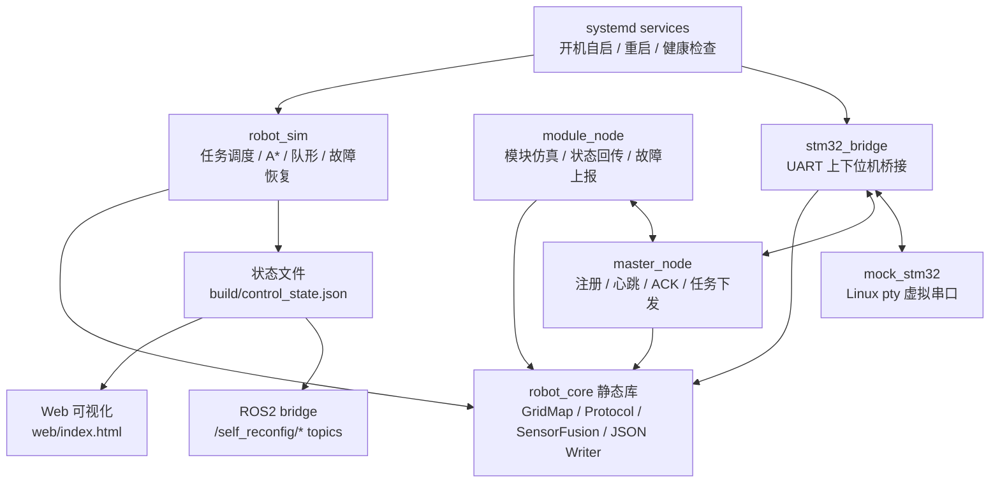

# 系统架构说明

本项目定位为自重构机器人多模块协同控制的嵌入式 Linux 上位机原型。它重点验证控制层、通信层、部署层和可视化闭环，而不是完整机械结构。

## 总体架构

## 代码分层

| 层次 | 主要文件 | 面试表达 |
| --- | --- | --- |
| 控制决策层 | `src/main.cpp`, `src/control_state_writer.cpp` | 多阶段任务、合体/分体模式、leader 选举、故障恢复、动态重规划 |
| 地图规划层 | `src/grid_map.cpp` | A* 搜索、动态占用格避障、line-of-sight 航点平滑 |
| 感知融合层 | `src/sensor_fusion.cpp` | 模拟融合里程计、视觉定位、IMU 航向和前向距离 |
| 通信协议层 | `src/protocol.cpp`, `src/udp_socket.cpp` | 自定义帧格式、CRC16、ACK、重传、心跳 |
| 下位机桥接层 | `src/stm32_bridge.cpp`, `src/serial_port.cpp`, `src/mock_stm32.cpp` | Linux `termios` 串口、STM32 反馈解析、pty 虚拟串口联调 |
| 可视化/ROS2 层 | `web/index.html`, `ros2/self_reconfig_control` | 状态复盘、ROS2 topic 发布、演示闭环 |
| 部署运维层 | `deploy/systemd`, `scripts/health_monitor.sh` | 板端服务化、异常重启、日志与健康检查 |

## 数据流

1. `robot_sim` 运行控制循环，生成地图、模块、任务、路径、队形、事件和指标。
2. `control_state_writer` 将控制状态写入 `build/control_state.json`。
3. Web 页面定时读取 JSON，展示地图、事件、任务阶段和复盘指标。
4. ROS2 bridge 读取同一个 JSON，把关键字段发布到 `/self_reconfig/*` topic。
5. UDP demo 中，`master_node` 通过协议帧管理 `module_node` 或 `stm32_bridge`，实现注册、心跳、ACK、任务下发和故障上报。

## 面试边界

可以强调：

- 项目已经覆盖上位机控制、通信、部署和演示闭环。
- 当前物理运动学和传感器模型是简化模型，用于验证协同控制逻辑。
- 真实硬件版本可以把 `module_node` 替换成 `stm32_bridge + STM32`，或进一步迁移到 ROS2 typed message/action。

不要夸大为：

- 已完成完整机械自重构整机。
- 已完成真实多传感器标定和闭环底盘控制。
- 已完成工业级 ROS2 typed interface。
